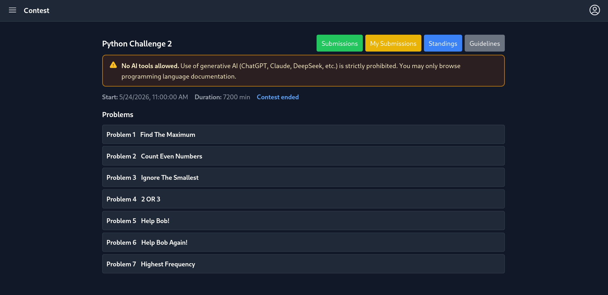
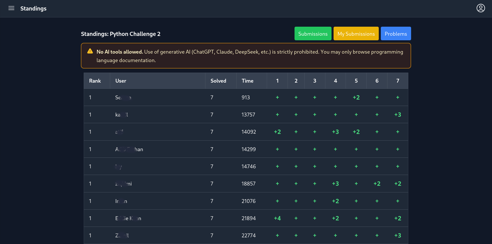
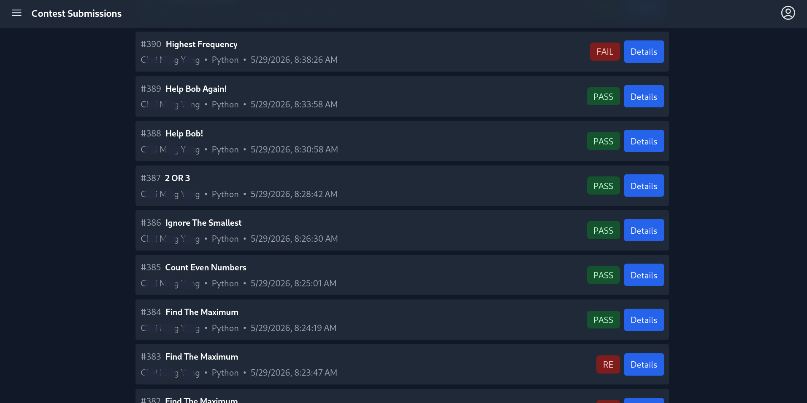
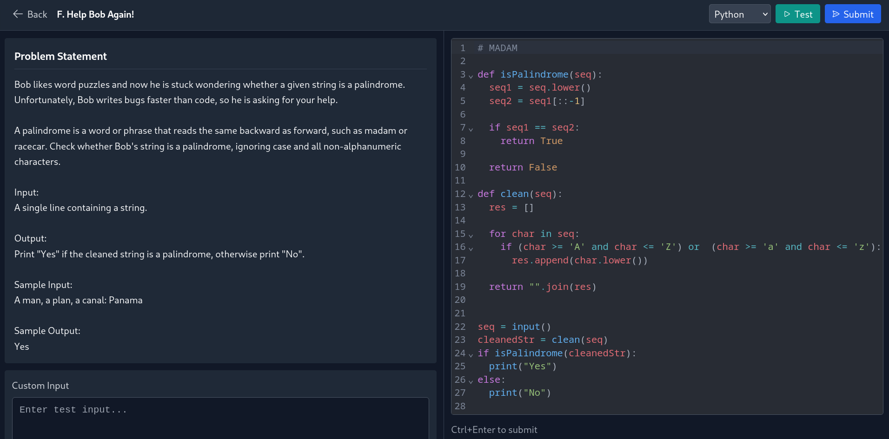
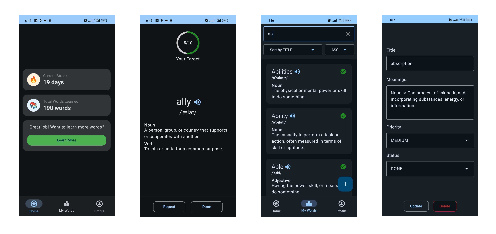
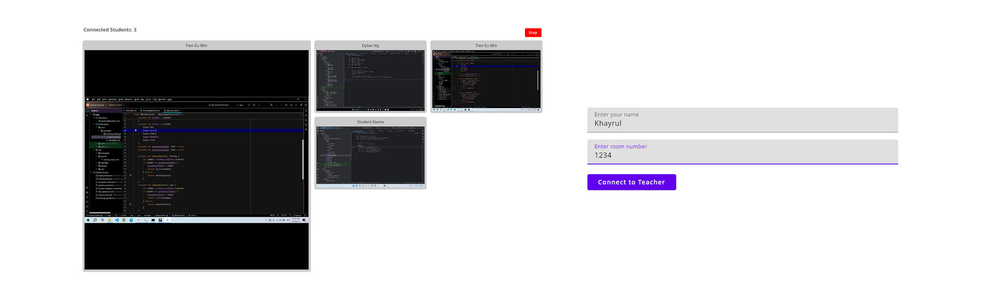

# Khayrul Islam

## Mobile Application Developer

### Summary

Software Engineer and Technical Instructor with **5+ years of experience** building native Android, cross-platform, and full-stack applications. Strong in **Kotlin** and **Jetpack Compose**, with hands-on experience in **Flutter**, **React Native**, **React**, and **Go**, and a consistent focus on clean architecture, performance, testing, and CI/CD. Experienced in mentoring students and developers, reviewing code, and building reliable products with strong attention to UI/UX and maintainability.

---

### Technical Skills

- **Languages:** Kotlin, Java, Dart (Flutter), JavaScript
- **Frameworks & Libraries:** Jetpack Compose, Android Jetpack, Room, Dagger-Hilt, Retrofit, Coroutines, LiveData
- **Tools & Platforms:** Android Studio, Firebase, Git, SQLite, REST APIs, CI/CD, WorkManager, Alarm Manager
- **Architecture:** MVVM, MVI, Clean Architecture
- **Testing:** JUnit, Espresso

---

### Work Experience

#### **Software Development Instructor (Mobile)** - *Forward College, Malaysia* *(Aug 2022 - Present)*

- Teaching **Android development with Kotlin** and **Flutter** to students.
- Instructing on **advanced Kotlin topics**, including **threads, coroutines, and OOP**.
- Coaching students on **MVVM architecture, Firebase, and database integration**.
- Conducting hands-on **state management** lessons with **Provider and Riverpod**.
- Mentoring students on **unit testing, Git workflows, and best practices**.

#### **Software Engineer (Mobile)** - *KAODIM, Malaysia* *(Jan 2022 – July 2022)*

- Developed a **Native Android Application** using **Kotlin and Jetpack Compose**.
- Wrote **unit tests** and integrated them into the **CI/CD pipeline**.
- Integrated **Facebook App Events** to track user engagement from ads.
- Set up **Slack webhook notifications** for Firebase App Distribution.
- Followed **SOLID principles** for maintainable and scalable code.

#### **Jr. Software Engineer (Mobile)** - *MyMedicalHUB, Bangladesh* *(Nov 2020 – Dec 2021)*

- Developed a **cross-platform mobile application** for Android and iOS.
- Communicated with stakeholders to gather requirements and implemented features.
- Successfully conducted testing and **published the application**.
- Worked in an **Agile development environment**, ensuring timely delivery.

---

### Projects

#### **Oto Judge - Online Judge System** *(Web, Go, React)*
-  
-  
- Built a **full-stack online judge platform** for programming contests, allowing users to browse problems, submit solutions, and track contest progress from a single web interface.
- Developed the **backend with Go, Gin, and PostgreSQL**, implementing JWT authentication, role-based access control, and contest time-based permissions.
- Implemented a **multi-language judging pipeline** supporting **C++**, **Python**, **JavaScript**, **Java**, **Kotlin**, and **Go** with automated compile and run workflows.
- Added **real-time submission and standings updates** using **Server-Sent Events (SSE)** so participants and admins can monitor contests live.
- Created an **admin dashboard** for managing users, contests, problems, submissions, rejudge actions, and soft-deleted records.
- Designed the submission flow to handle **execution results, rejudging, and special judge review cases** for contest-specific evaluation needs.
- **Tech Stack:** Go, Gin, PostgreSQL, React, Tailwind CSS, JWT, Server-Sent Events, Bash

---

#### **Word Learning App** *(Android, Kotlin)*

- Built an **interactive vocabulary-building app** to help users learn English words efficiently.
- Implemented **daily streaks** to encourage consistent learning, allowing users to fix missed streaks by learning extra words.
- Used **Room Database** for offline storage, enabling users to add their own words.
- Integrated **Google Sign-In** for user authentication, syncing data using **WorkManager**.
- Added **notification reminders** via **Alarm Manager** to notify users if they miss a streak.
- Included **pronunciations** to enhance learning.
- Implemented **Dark Theme** for better user experience and reduced eye strain.
- Integrated **Dynamic Colors**, adapting the app’s UI based on the user’s wallpaper and system settings.
- **Tech Stack:** Kotlin, Jetpack Compose, Firebase, WorkManager, Room Database, Dagger-Hilt, Alarm Manager

---

#### **Exam Guard - IT Student Monitoring System** *(Compose Desktop, Kotlin)*

- Developed a **desktop application** to monitor students during practical exams.
- **Two-part system:**
  - **Teacher (Host):** Starts the monitoring session with a specific port, creating a virtual room.
  - **Student (Client):** Joins by entering a room number and automatically discovers the host.
- Implemented **real-time screen sharing**, allowing teachers to monitor multiple students simultaneously.
- Ensured **automatic reconnection** for students in case of network drops.
- Used **IP discovery** to simplify connections without manual configuration.
- **Tech Stack:** Kotlin, Compose Desktop, Sockets, MVVM

---

### Education

- **B.Sc. in Computer Science & Engineering** - *University of Rajshahi, Bangladesh (2016 - 2020)*

---

## Competitive Programming  
- **UVA Online Judge:** 330+ problems solved (*Handle: khayrul*)  
- **Codeforces Rating:** Max **1575** (*Handle: beta-ori*)  
- **Leetcode:** 115+ problems solved (*Handle: khayrul000*)  

## GitHub Statistics  
  
  

## Let's Connect!  
📧 Email: [khayrultw@gmail.com](mailto\:khayrultw@gmail.com)\
📞 WhatsApp: [Chat with me](https://wa.me/601126261660) \
💼 GitHub: [github.com/khayrultw](https://github.com/khayrultw)\
💼 LinkedIn: [linkedin.com/in/md-khayrul-islam](https://www.linkedin.com/in/md-khayrul-islam)
